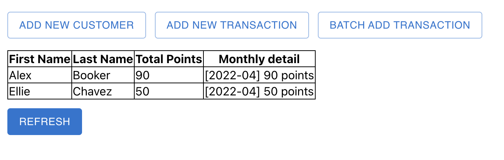
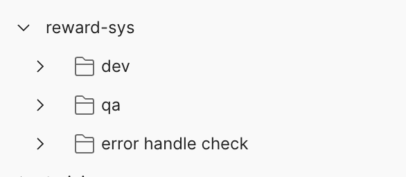

# Rewards Program


## Live Demo

[http://reward-sys.s3-website.us-east-2.amazonaws.com/](http://reward-sys.s3-website.us-east-2.amazonaws.com/)


## Project assumption

#### Business Requirements:

Reward Calculation Logic: A customer earns rewards based on their spending per transaction:

- Earn 1 point for every dollar spent over $50 up to $100.
- Earn an additional 2 points for every dollar spent over $100.
- Transactions under $50 earn no points.

#### Technical Requirements:

- Input data will be received in JSON format containing details such as customer ID, transaction amount, and date.
- Api should support the following:
    - Add a transaction for a specific customer.
    - Add multiple transactions for multiple customers.
    - Get the reward points earned for each customer per month and total. (support filtering: by customer name)
    - Add a customer to system
    - Get all customers in the system
- Use H2 in-memory database to store the data, and `schema.sql` to initialize the database.
- The primary requirement is to develop a backend service, lightweight frontend (ReactJS) support show the functionality
  of the backend.
- No swagger documentation required.

#### Testing Assumptions:

- Comprehensive unit tests will be created using JUnit and Mockito to simulate various scenarios and validate the reward
  calculation logic.
- Jacoco will be used to measure the code coverage of the unit tests.
- Integration test should be done by postman collection, relative input should be provided.

#### Deployment Assumptions:

- simple fast deployment for better presentation.

## Tech Stack

Spring Boot + H2 + JPA

| Name        | Version |
|-------------|---------|
| Java        | 17      |
| Spring boot | 3.2.5   |
| Spring JPA  | 3.2.5   |
| lombok      | 1.18.20 |
| h2          | 2.2.224 |
| jacoco      | 0.8.7   |

## Get Started

### Run backend service

1. Clone the repository in [https://github.com/lixphilosophy/reward-sys](https://github.com/lixphilosophy/reward-sys)
2. Install the dependencies

``` sh
mvn clean install
```

3. Run the application in the IDE

### Run frontend service

1. Clone the repository
   in [https://github.com/lixphilosophy/reward-sys-fe](https://github.com/lixphilosophy/reward-sys-fe)
2. Install the dependencies

``` sh
npm install
```

3. Run the application

``` sh
npm run start:dev
```

## Testing

There is a postman collection for testing the API endpoints.

File location: [docs/reward-sys.postman_collection](docs/reward-sys.postman_collection.json)

Import
Instruction: [Import data into Postman](https://learning.postman.com/docs/getting-started/importing-and-exporting/importing-data/)

After importing the collection, you can see the following struct:


- dev folder: contains the local testing environment
- qa folder: contains the live demo environment
- error handle check: contains invalid data testing the api error handling

## API Endpoints

| Method | Endpoint                             | Description                                                                                            |
|:-------|:-------------------------------------|:-------------------------------------------------------------------------------------------------------|
| `POST`   | `/transaction/api/v1/add`            | Add a transaction into the system                                                                      |
| `GET`    | `/customer/api/v1/add`               | Add a customer in the system, then user can find them when append new transaction                      |
| `POST`   | `/transaction/api/v1/batch/add`      | Batch add transaction history to the system, it allow insertign multiple transaction for multiple user |
| `POST`   | `/reward/api/v1/pointSummary/getAll` | Return the point reward summary for all the user, it support search by user name                       |
| `POST`   | `/customer/api/v1/getAll`            | Return all the customer in the system, it will be used when try to add transaction                     |

## Error handling
for each endpoint, there are some request validation, if the request is invalid, the response will be like:
``` json
// 400 Bad Request
{
    "msg": "Please provide customer firstname and lastname",
    "code": "fail",
    "data": {
        "ent": null,
        "ext": null
    }
}
```
- `/transaction/api/v1/add`
    - customer id is required
    - transaction amount is required
    - valid transaction date is required
- `/customer/api/v1/add`
    - customer firstname is required
    - customer lastname is required
- `/transaction/api/v1/batch/add`
    - each transaction should have customer id, transaction amount, and valid transaction date
- `/reward/api/v1/pointSummary/getAll`
    - no validation, but it support search by customer name (fn or ln)
- `/customer/api/v1/getAll`
    - no validation

## Deployment

The backend service is deployed on AWS EC2 with docker.
The frontend service is deployed on AWS S3.

Publish docker image for deployment
``` sh
 docker buildx build --platform linux/amd64 -t lixphilosophy/reward-sys:1.x .
 docker push lixphilosophy/reward-sys:1.x
```
Pull the image from docker hub and run it
``` sh
docker run -d -p 8080:8080 lixphilosophy/reward-sys:1.x
```